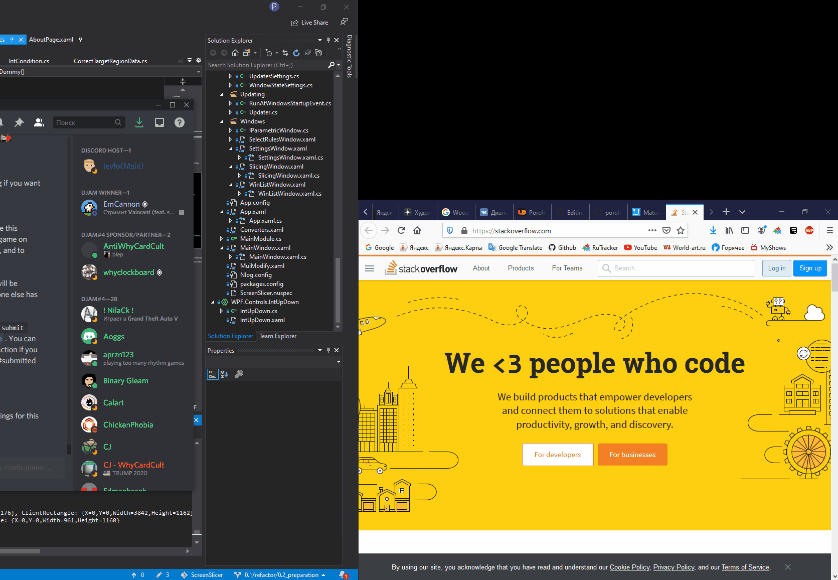

# ScreenSlicer
This application is designed to conveniently place multiple windows on ultrawide monitors. It works the same for multi-screen setups.

Download binaries from [releases page](https://github.com/porohkun/ScreenSlicer/releases)
## How it works

